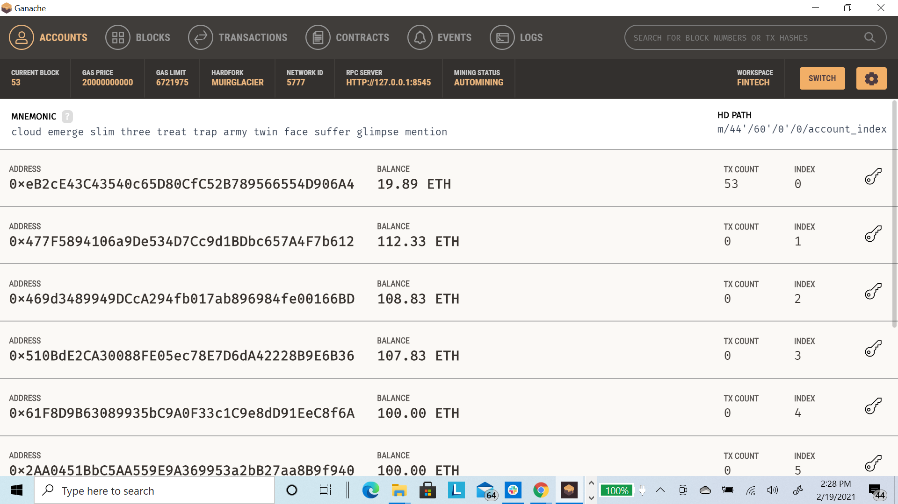
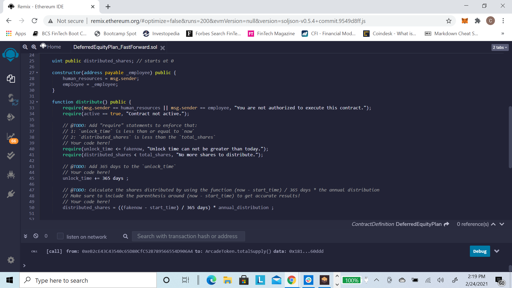

# Solidity Smart Contracts

The task is to build 3 Ethereum-compatible blockchain contracts to distribute profit plans using Solidity smart contracts. The following 3 tools will be used to build the solidity smart contracts: 

|  | |  | 
|:---:|:---:|:---:|
| Remix | MetaMask | Ganache|

For this excercise, we will code and test the smart contracts on our local host. Once we've successfully coded and tested our Smart Contracts, we can deploy them to a public and live ETH blockchain Testnet such as Kovan or Ropsten.

There are 3 levels to building smart contracts for profit plan distributions, with each contract increasing in difficulty, complexity and capability. 

# Level One: The Associate Profit Splitter Contract

The **Associate Profit Splitter** will accept Ether into the contract and divide the Ether evenly among the employees. This will allow the Human Resources department to pay employees quickly and efficiently. In this scenario, we will be paying the following employees:
- employee_one or the CEO
- employee_two or the CTO
- employee_three or Bob

## Smart Contract Code in Solidity

## Compile the Smart Contract Code in Solidity
Next, we need to compile the code in Solidity to ensure there are no coding issues or errors.

After compiling the code, you can see the green checkmark indicating our code is good. We can now move to the next step to deploy the smart contract. 

## Deploying the Smart Contract Code in Solidity
First, open the Ganache application and choose the workspace you will be using. Be sure you have prefunded ETH accounts in this workspace. Any smart contract deployment will be executed in the blockchain. Although smart contracts are deployed with 0 wei, you will be paying gas (i.e. an ETH Fee) for the deployment. Without ETH prefunded, you cannot deploy the smart contract.

Next, ensure you are logging into Metamask. Ensure that you are connected to the same network as your Ganache workkspace. 

Before deploying your smart contract you will need to enter the ETH wallet addresses for each employee. We will choose 3 addresses from our existing Ganache workspace for testing purposes.

| ||
|:---:|:---:|
| Ganache | Remix |

Now we can deploy our smart contract using the "transact" button and then confirming (click the "Confirm" button) the transaction in MetaMask by.

| ||
|:---:|:---:|
| Remix transact | MetaMask confirmation |

*NOTE: You should see a MetaMask confirmation of the transaction along with the transaction informaton at the bottom of the Remix screen. You can confirm the transaction was also successful via Ganache transaction history.*

| ||
|:---:|:---:|
| Ganache TXN History  | Ganache TXN detail |

Once the contract has been activated, let's test the functionality by transferring 15 and 4 Ether into the employees' accounts. Note that the contract should splt the fractional ETH shares and there should be 1 wei going back to the original wallet address (in this case Human Resources or "HR").

|  | |  | 
|:---:|:---:|:---:|
| 15 ETH Deposit | 15 ETH Transact| 15 ETH TXN Confirmation|

|  | |  | 
|:---:|:---:|:---:|
| 4 ETH Deposit | 4 ETH Transact | 4 ETH Confirmation|

You'll see that Ganache before and after, shows a total of 19 ETH was taken from the main wallet, i.e. HR, and 6.33 ETH was deposited into each employee's wallets (employee_one, employee_two, and employee_three).

|  | |  | 
|:---:|:---:|:---:|
| 15 ETH Deposit | 15 ETH TXN| 15 ETH TXN Detail|

|  | |  | 
|:---:|:---:|:---:|
| 4 ETH Deposit | 4 ETH TXN | 4 ETH TXN Detail|

# Level Two: The Tiered Profit Splitter Contract

The **Tiered Profit Splitter** will distribute different percentages of Ether to employees at different tiers/levels rather than an 1/3 split to each employee. For this example, the CEO will receive 60%, the CTO will receive 25%, and Bob will receive 15%.

| |  |
|:---:|:---:|
| Tiered Profit Splitter - Part 1 | Tiered Profit Splitter - Part 2 |

*NOTE: For this coding excercise we are using the += syntax to perform a mathimatical addition function. However, if the wallets have a zero balance, this could cause issues as there is a flaw in Soldity using uint for mathematical operations. As a best practice, for any mathematical functions, it's highly recoomended to use SafeMath when coding in REMIX.*
- import "github.com/OpenZeppelin/openzeppelin-contracts/blob/release-v2.5.0/contracts/math/SafeMath.sol";

*This only works in REMIX. Alternatively, you can paste the contents of SafeMath.sol from GitHub into your smart contract code. More information on SafeMath can be found here:*
[Open Zepplin Docs](https://docs.openzeppelin.com/contracts/3.x/)

We follow the same steps as Level One. After writing the Soldity code, then compile the code, to ensure there are no errors, and then deploy the contract with 0 wei, for which there is a ETH fee, or gas, charged to primary wallet (in this case HR).*

| |  |
|:---:|:---:|
| Tiered Profit Splitter - Compile | Tiered Profit Splitter - Add Employee Wallet Addresses |

| |  |
|:---:|:---:|
| Tiered Profit Splitter - Deploy | Tiered Profit Splitter - MetMask Confirmation |

Let's confirm the contract has been successfully activated via Ganache.

| |  |
|:---:|:---:|
| Ganache - Tiered Profit Splitter - TXN History | Ganache - Tiered Profit Splitter - TXN Detail |

Once the contract has been activated we will test the functionality by transferring 10 Ether into the employees' accounts.
| |  |  |
|:---:|:---:|:---:|
| 10 ETH Deposit | 10 ETH confirm via MetaMask | 10 ETH MetaMask Confirmation|

You'll see that Ganache wallet balances are now updated. 10 ETH was removed from the first account (i.e. HR) and ETH was deposited into each employee's account as follows: 6 ETH to employee_one (i.e. CEO 60%), 2.5 ETH to employee_two (i.e. CTO 25%), and 1.5 ETH to employee_three (i.e. Bob 15%).

| |  |  |
|:---:|:---:|:---:|
| Ganache Wallet Balances| Ganache TXN History | Ganache TXN Detail|

# Level Three: The Deferred Equity Plan Contract

The **Deferred Equity Plan** models traditional company deferred compensation plans. For this example, the contract will automatically distribute 1,000 shares of company stock per employee with an annual distribution of 250 shares for each employee over a 4 years time period.

| |  |  |
|:---:|:---:|:---:|
| Deferred Equity Plan - 1 | Deferred Equity Plan - 2 | Deferred Equity Plan - 3 |

Because this contract has a lock period, there was a **DeferredEquityPlan_FastForward** contract created to test the functionality of the contract based on false dates. Also, because of limited ETH in my test HR wallet from Level 1 and Level 2 above, I will use 4 other wallets to test the code for the **Deferred Equity Plan**.

| |  |  |
|:---:|:---:|:---:|
| Deferred Equity Plan Fast Forward - 1 | Deferred Equity Plan Fast Forward - 2 | Deferred Equity Plan Fast Forward - 3 |

After compiling the Fast Forward code, deploy the contract with 0 wei, for which there is a fee, or gas, charged to main wallet address (i.e. HR).

Once the contract has been activated we will test the functionality by transferring into the employees' accounts.

