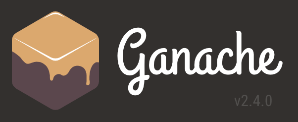

# Solidity Contracts

This homework assignment required we build 3 Ethereum-compatible blockchain contracts to distribute profit plans. We used the following 3 tools to build our solidity contracts: 

| | | |
|:---:|:---:|:---:|
| Ganache | MetaMask | Remix |

This assignment has 3 levels of difficulty, with each contract increasing in complexity and capability. I was able to sucessfully create and deploy 2 of the 3 contracts, however the third contract would not deploy under test conditions. In light of homework deadlines, I have included the attempt at deploying the third contract and the error message generated.

### Level One: The `AssociateProfitSplitter` Contract