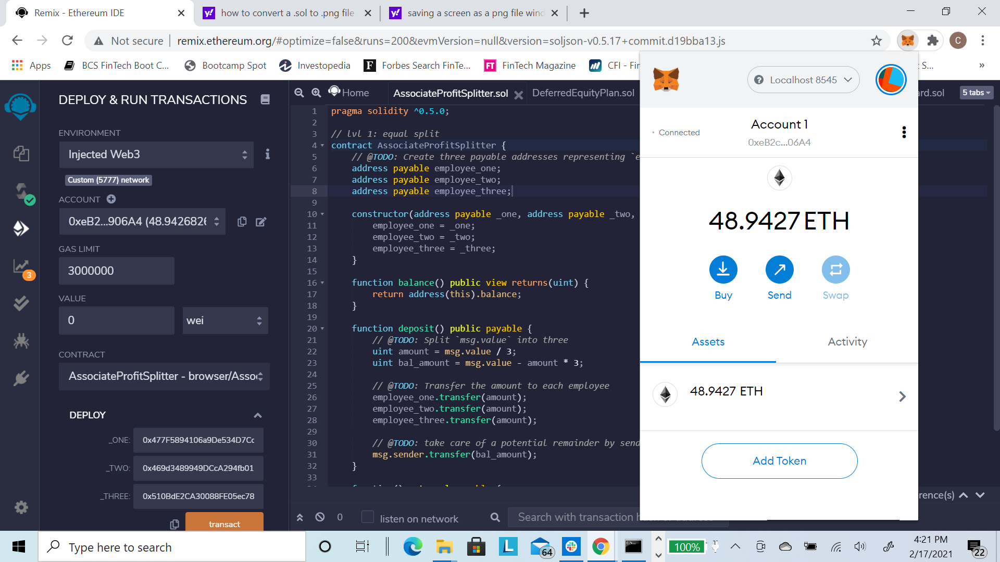

# Solidity Smart Contracts

The task is to build 3 Ethereum-compatible blockchain contracts to distribute profit plans using Solidity smart contracts. The following 3 tools will be used to build the solidity smart contracts: 

|  | |  | 
|:---:|:---:|:---:|
| Remix | MetaMask | Ganache|

There are 3 levels to building smart contracts for profit plan distributions, with each contract increasing in difficulty, complexity and capability. 

### Level One: The Associate Profit Splitter Contract

The **Associate Profit Splitter** will accept Ether into the contract and divide the Ether evenly among the employees. This will allow the Human Resources department to pay employees quickly and efficiently. In this scenario, we will be paying the following employees:
- employee_one or the CEO
- employee_two or the CTO
- employee_three or Bob

## Smart Contract Code in Solidity

## Compile the Smart Contract Code in Solidity
Next, we need to compile the code in Solidity to ensure there are no coding issues or errors.

After compiling the code, you can see the green checkmark indicating our code is good. We can now move to the next step to deploy the smart contract. 

## Deploying the Smart Contract Code in Solidity
First, open the Ganache application and choose the workspace you will be using. Be sure you have prefunded ETH accounts in this workspace. Any smart contract deployment will be executed in the blockchain. Although smart contracts are deployed with 0 wei, you will be paying gas (i.e. an ETH Fee) for the deployment. Without ETH prefunded, you cannot deploy the smart contract.

Next, ensure you are logging into Metamask. Ensure that you are connected to the same network as your Ganache workkspace. 

Before deploying your smart contract you will need to enter the ETH wallet addresses for each employee. We will choose 3 addresses from our existing Ganache worspace for testing purposes.

| ||
|:---:|:---:|
| Ganache | Remix |

Now we can deploy our smart contract using the "transact" button and then confirming (click the "Confirm" button) the transaction in MetaMask by.

| ||
|:---:|:---:|
| Remix transact | MetaMask confirmation |

*NOTE: You should see a MetaMask confirmation of the transaction along with the transaction informaton at the bottom of the Remix screen. You can confirm the transaction was also successful via Ganache transaction history.*

| ||
|:---:|:---:|
| Ganache TXN History  | Ganache TXN detail |

Once the contract has been activated, let's test the functionality by transferring 15 and 4 Ether into the employees' accounts. Note that the contract should splt the fractional ETH shares and there should be 1 wei going back to the original wallet address (in this case Human Resources or "HR").

|  | |  | 
|:---:|:---:|:---:|
| 15 ETH Deposit | 15 ETH Transact| 15 ETH TXN Confirmation|

|  | |  | 
|:---:|:---:|:---:|
| 4 ETH Deposit | 4 ETH Transact | 4 ETH Confirmation|

You'll see that Ganache before and after, shows 19 Ether was taken from Account 1 and 6.33 Ether was deposited into each employee's account (Account 2, Account 3, and Account 4).

|  | |  | 
|:---:|:---:|:---:|
| 15 ETH Deposit | 15 ETH TXN| 15 ETH TXN Detail|

|  | |  | 
|:---:|:---:|:---:|
| 4 ETH Deposit | 4 ETH TXN | 4 ETH TXN Detail|

### Level Two: The TieredProfitSplitter Contract

The **TieredProfitSplitter** will distribute different percentages of incoming Ether to employees at different tiers/levels. For example, the CEO gets paid 60%, CTO 25%, and Bob gets 15%.

After compiling the code, we deploy the contract with 0 wei, for which there is a fee charged to our Ether account.

Once the contract has been activated we will test the functionality by transferring 99 Ether into the employees' accounts.

You'll see that Ganache before and after, shows 99 Ether was taken from Account 6 and Ether was deposited into each employee's account (59.40 to Account 2 (60%), 24.75 to Account 3 (25%), and 14.85 to Account 4 (15%)).

|||
|:---:|:---:|
| Account Value Pre-TieredProfitSplitter | Account Value Post-TieredProfitSplitter |

### Level Three: The `DeferredEquityPlan` Contract

**`DeferredEquityPlan`** models traditional company stock plans. This contract will automatically manage 1000 shares with an annual distribution of 250 over 4 years for a single employee.

Because this contract has a lock period, there was a **`DeferredEquityPlan_FastForward`** contract created to test the functionality of the contract based on false dates. Also, because of limited Ether in the test accounts, for test purposes, the 1000 total distribution shares was reduced to 100 and the 250 annual shares was reduced to 25.

After compiling the code, we deploy the contract with 0 wei, for which there is a fee charged to our Ether account.

Once the contract has been activated we will test the functionality by transferring 25 Ether into the employees' accounts.

This is where the error message occurred. After multiple attempts at correcting the code and recompiling and redeploying, the error message was not resolved.